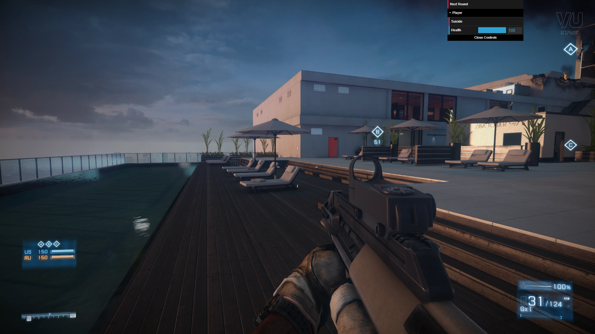

# Venice Unleashed DebugGUI

Venice Unleashed DebugGUI is a simple framework to easily create debug controls from both your client and server scripts, instead of relying only on Console/Chat/RCON or having to create custom WebUI controls for every new project.

## Example

In the following example, you can see how easy is to create a number of controls

```lua
require "__shared/DebugGUI"

-- A button to move to the next round
DebugGUI:Button("Next Round", function()
  RCON:SendCommand("mapList.runNextRound")
end)

-- A folder that groups player related controls
DebugGUI:Folder("Player", function ()
  -- A button to kill the local player
  DebugGUI:Button("Suicide", function(value, player)
    if player ~= nil and player.soldier ~= nil then
      player.soldier:Kill()
    end
  end)

  -- A range slider to adjust player's health
  DebugGUI:Range("Health", {DefValue = 100}, function(value, player)
    if player ~= nil and player.soldier ~= nil then
      player.soldier.health = value
    end
  end)
end)

```

The above code will create this result



## Usage

1. Download and add this mod into your server's ModList
2. Copy the `ext/shared/DebugGUI.lua` file into the shared folder of the mod that you want to debug
3. Require this file and start adding some controls based on the examples here

Press `F1` to toggle the mouse/keyboard (you can change the key in the config).

## Supported Controls

There's a number of avaible controls to use, based on what dat.GUI has to offer.

In every case, the callback has the `value` as the first argument. If the control was created in a server script, the `player`, who triggers it, is passed as the second argument.

### Button
```
DebugGUI:Button(name, [context,] callback)
```

### Checkbox
```
DebugGUI:Checkbox(name, defValue, [context,] callback)
```

### Text
```
DebugGUI:Text(name, defValue, [context,] callback)
```

### Number
```
DebugGUI:Number(name, defValue, [context,] callback)
```

### Range
```
DebugGUI:Range(name, options, [context,] callback)

options = {
  DefValue
  Min       (0)
  Max       (100)
  Step      (1)
}

```

### Dropdown
! Unfortunately, native dropdowns don't work as expected in VU
```
DebugGUI:Dropdown(name, options, [context,] callback)

options = {
  DefValue
  Values
}
```

## Notice

* There's no automatic syncing between clients. It's up to the mod developer to sync those changes.

* You can't update the control's value from lua after it's creation, for now.

## License

[MIT](https://choosealicense.com/licenses/mit/)
