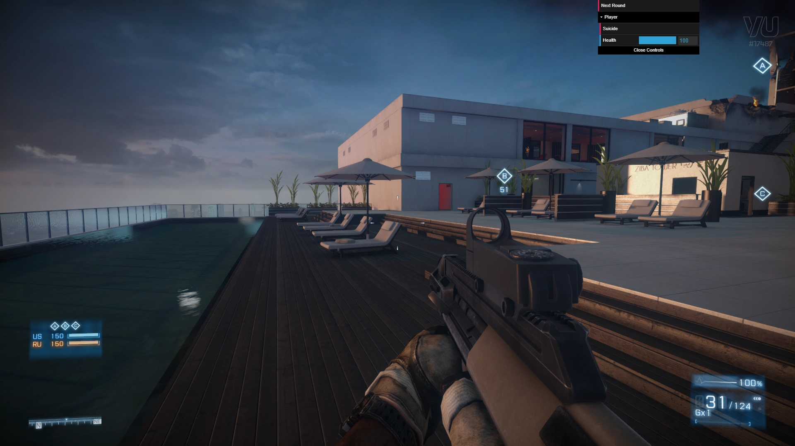

# Venice Unleashed DebugGUI

A framework for creating debug controls from your client and server scripts — no custom WebUI needed.



## Quick Start

1. Add this mod to your server's `ModList`.
2. Copy `ext/shared/DebugGUI.lua` into your mod's `ext/shared/` folder.
3. `require "__shared/DebugGUI"` at the top of your scripts and start adding controls.
4. Press **F1** in-game to toggle the panel.

```lua
require "__shared/DebugGUI"

DebugGUI:Button("Next Round", function()
  RCON:SendCommand("mapList.runNextRound")
end)

DebugGUI:Folder("Player", function()
  DebugGUI:Button("Suicide", function(value, player)
    if player ~= nil and player.soldier ~= nil then
      player.soldier:Kill()
    end
  end)

  DebugGUI:Range("Health", {DefValue = 100}, function(value, player)
    if player ~= nil and player.soldier ~= nil then
      player.soldier.health = value
    end
  end)
end)
```

## API Reference

Every control method returns a `DebugGUIControl` instance (see [Reading and Writing Control Values](#reading-and-writing-control-values)).

All controls accept an optional `context` parameter before the callback (see [Context](#context)).

### Callback Signature

When a control's value changes, your callback fires:

- **Without context:** `callback(value, player)`
- **With context:** `callback(context, value, player)`

`player` is the triggering player when the control was created on the **server**. It is `nil` for client-side controls.

### Button

```lua
DebugGUI:Button(name, [context,] callback)
```

Does not have a value — the callback fires on click with no `value` argument.

```lua
DebugGUI:Button("Heal All", function(_, player)
  -- callback receives (value, player), value is nil for buttons
end)
```

### Checkbox

```lua
DebugGUI:Checkbox(name, defValue, [context,] callback)
```

```lua
DebugGUI:Checkbox("God Mode", false, function(value, player)
  if player ~= nil and player.soldier ~= nil then
    player.soldier:SetHealthRecharge(value and 999 or 1)
  end
end)
```

### Text

```lua
DebugGUI:Text(name, defValue, [context,] callback)
```

```lua
DebugGUI:Text("Say Message", "", function(value, player)
  if value ~= "" then
    ChatManager:Yell(value, 5)
  end
end)
```

### Number

```lua
DebugGUI:Number(name, options, [context,] callback)
```

`options` can be a plain number (for just a default value) or a table:

```lua
options = {
  DefValue   -- initial value (defaults to Min if omitted)
  Min        -- (0)
  Max        -- (1)
  Step       -- (nil, free input)
}
```

`Min`, `Max`, and `Step` are enforced on blur — values are clamped to the range and rounded to the nearest step increment.

```lua
-- Simple: just a default
DebugGUI:Number("Multiplier", 1.0, function(value, player)
  -- ...
end)

-- Constrained
DebugGUI:Number("Tickets", {DefValue = 200, Min = 0, Max = 1000}, function(value, player)
  -- ...
end)
```

### Range (Slider)

```lua
DebugGUI:Range(name, options, [context,] callback)

options = {
  DefValue   -- initial value (defaults to Min if omitted)
  Min        -- (0)
  Max        -- (100)
  Step       -- (1)
}
```

```lua
DebugGUI:Range("Speed", {DefValue = 1.0, Min = 0.1, Max = 5.0, Step = 0.1}, function(value, player)
  if player ~= nil and player.soldier ~= nil then
    player.soldier.soldierData.visualUnlock.maxSpeed = value
  end
end)
```

### Dropdown

```lua
DebugGUI:Dropdown(name, options, [context,] callback)

options = {
  Values     -- REQUIRED. Array of values or table mapping labels to values
  DefValue   -- initial value (defaults to first element of Values)
}
```

`Values` can be a simple array (display === stored value) or a label→value map:

```lua
-- Array: display equals stored value
DebugGUI:Dropdown("Map", {Values = {"Caspian Border", "Operation Metro", "Damavand Peak"}}, function(value, player)
  print(value)  -- "Caspian Border", "Operation Metro", or "Damavand Peak"
end)

-- Key-value: different display label and stored value
DebugGUI:Dropdown("Quality", {Values = {Low = 128, Medium = 256, High = 512}, DefValue = 256}, function(value, player)
  print(value)  -- 128, 256, or 512
end)

-- With explicit default
DebugGUI:Dropdown("Mode", {Values = {"Easy", "Normal", "Hard"}, DefValue = "Normal"}, function(value, player)
  -- ...
end)
```

### Vec2 / Vec3 / Vec4

```lua
DebugGUI:Vec2(name, options, [context,] callback)
DebugGUI:Vec3(name, options, [context,] callback)
DebugGUI:Vec4(name, options, [context,] callback)
```

`options` can be a vector (for just a default value) or a table:

```lua
-- Short form: just a default vector
DebugGUI:Vec3("Position", Vec3(0, 0, 0), function(value, player)
  -- value is a Vec3
end)

-- Full form: per-component constraints
DebugGUI:Vec3("Position", {
  DefValue = Vec3(0, 50, 0),
  x = { Min = -100, Max = 100, Step = 1 },
  y = { Min = 0,   Max = 200, Step = 1 },
  z = { Min = -100, Max = 100, Step = 1 },
}, function(value, player)
  -- value is a Vec3
end)
```

Default axis constraints: `Min = 0, Max = 1`. Omitted `Step` means free input.

### Folder

```lua
DebugGUI:Folder(name, [context,] callback)
```

Groups controls under a collapsible section. All `DebugGUI` calls inside the callback become children of the folder. Folders cannot be nested.

```lua
DebugGUI:Folder("Weapons", function()
  DebugGUI:Range("Damage", {DefValue = 25, Min = 0, Max = 100}, function(value)
    -- ...
  end)
end)
```

## Reading and Writing Control Values

Every control method returns a `DebugGUIControl` instance.

### Get

Use `:Get()` to read its current value at any time.

```lua
local healthSlider = DebugGUI:Range("Health", {DefValue = 100}, function(value, player)
  if player ~= nil and player.soldier ~= nil then
    player.soldier.health = value
  end
end)

-- Read the slider's current value from anywhere
local currentHealth = healthSlider:Get()
```

Note: `:Get()` returns the value as last reported by the UI. It does not reflect external changes to the underlying game state.

### Set

Use `:Set(value)` to programmatically update a control's value from Lua. The UI widget updates immediately without firing the callback.

```lua
local healthSlider = DebugGUI:Range("Health", {DefValue = 100})
healthSlider:Set(50)  -- slider jumps to 50 in the UI
```

For vector controls, pass a `Vec2`, `Vec3`, or `Vec4`:

```lua
local posControl = DebugGUI:Vec3("Position", Vec3(0, 0, 0))
posControl:Set(Vec3(100, 200, 300))
```

Server-side `:Set()` broadcasts the new value to all connected clients automatically.

## Context

The optional `context` parameter lets you pass data into the callback without creating closures:

```lua
DebugGUI:Button("Kick Player", "PlayerName", function(context, value, player)
  -- context = "PlayerName"
  RCON:SendCommand("admin.kickPlayer " .. context)
end)
```

When `context` is used, it becomes the **first** argument to the callback, shifting `value` and `player` right.

## Managing Controls

### Remove

```lua
DebugGUI:Remove(id)
```

Removes a control by its GUID. The ID can be obtained from the control's serialized table:

```lua
local btn = DebugGUI:Button("Temp", function() end)
local id = btn:AsTable().Id

-- later
DebugGUI:Remove(id)
```

### Clear

```lua
DebugGUI:Clear()
```

Removes every control and wipes the panel. Useful when rebuilding the UI after a level change or mode switch.

## UI Visibility

```lua
DebugGUI:ShowUI()   -- show the panel programmatically
DebugGUI:HideUI()   -- hide the panel programmatically
```

On the **client**, these work immediately. On the **server**, pass a player to target a specific client:

```lua
DebugGUI:ShowUI(player)
DebugGUI:HideUI(player)
```

## Configuration

Edit `ext/shared/config.lua`:

```lua
DebugGUIConfig = {
  EnableMKBKey = InputDeviceKeys.IDK_F1,   -- key to toggle the panel
  ClickToDisableMKB = true                 -- TODO
}
```

Require the config if your mod needs to read or change these values:

```lua
require "__shared/config"
print(DebugGUIConfig.EnableMKBKey)
```

## Limitations

- **No automatic sync.** When a control changes game state, you must sync that change to other clients yourself.
- **Folders cannot be nested.**
- **Controls persist across level loads.** They are rebuilt with `Clear()` first on `Level:Loaded`, so old controls won't duplicate — but if your mod dynamically creates controls based on map state, you should call `DebugGUI:Clear()` and re-register them on level change.
- **Server-side controls are visible to all clients.** Client-side controls only appear for that client.

## License

[MIT](https://choosealicense.com/licenses/mit/)
